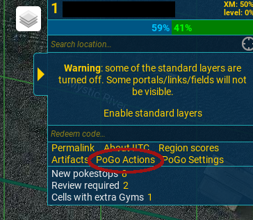
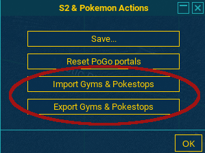
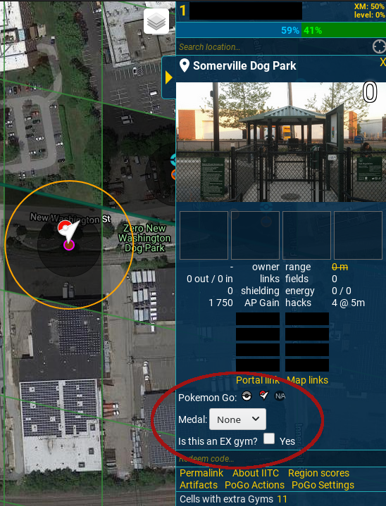
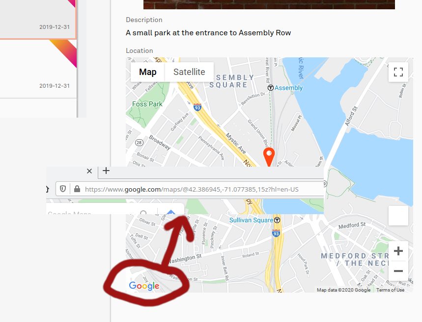
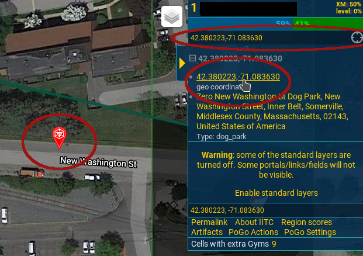

# Description
This repo contains json descriptions of Somerville/Cambridge Pokemon Gyms & Stops for use in the PoGo Tool add-on for Ingress Intel Total Conversion (IITC)

# Get PoGo Tools
First, get an Ingress account by downloading Ingress on your mobile device and following the prompts to create one.

Next, if you don't have it, you can get PoGo tools here: https://gitlab.com/AlfonsoML/pogo-s2

Instructions for installing and pre-requisites can be found in that repository. Support for any isssues you have with those tools should be directed at those communities.

Once the tools are loaded, you can use them on the Ingress intel portal: https://intel.ingress.com/intel

# How to import/export json
These screenshots are using the desktop version of IITC & PoGo Tools in Firefox, but should have a similar flow on other platforms & browsers.

To import, download [IITC-pogo.json](https://raw.githubusercontent.com/brandonhanks/camberville-pogo-tools/master/IITC-pogo.json) and use the **Import Gyms & Pokestops** button shown in the screenshot below to load it.

When you export your data, it will be named IITC-pogo.json by default.

# How to edit stop/gym/waypoint attributes

Try to not include Medals in this dataset, but if it becomes an issue I'll write a script to remove them.

# How to check where your submissions are

First go to https://wayfarer.nianticlabs.com/nominations and click on your submission. Find the embedded Google map and click the Google logo to open a Google Maps url. That URL will contain the exact latitude and longitude of your submission.

Now go back to https://intel.ingress.com/intel and input the latitude and longitude pair into the search box. You'll see a marker appear in the cell grid.

# How to contribute

If you want to contribute what you can see, first import the latest [IITC-pogo.json](https://raw.githubusercontent.com/brandonhanks/camberville-pogo-tools/master/IITC-pogo.json), then export the combined data as a new IITC-pogo.json. Add it to your repo and submit a pull request with the updated file.

If you don't know how to use git, you can email me your IITC-pogo.json at <bhanks@mit.edu> and I can add it for you.

# Resources and communities

**Wayfarer**
https://wayfarer.nianticlabs.com/

**Reddit**
https://www.reddit.com/r/NianticWayfarer/

**Discord**
https://discord.com/invite/EgpEYRy

**Ingress AMA** 
https://ingressama.com/

